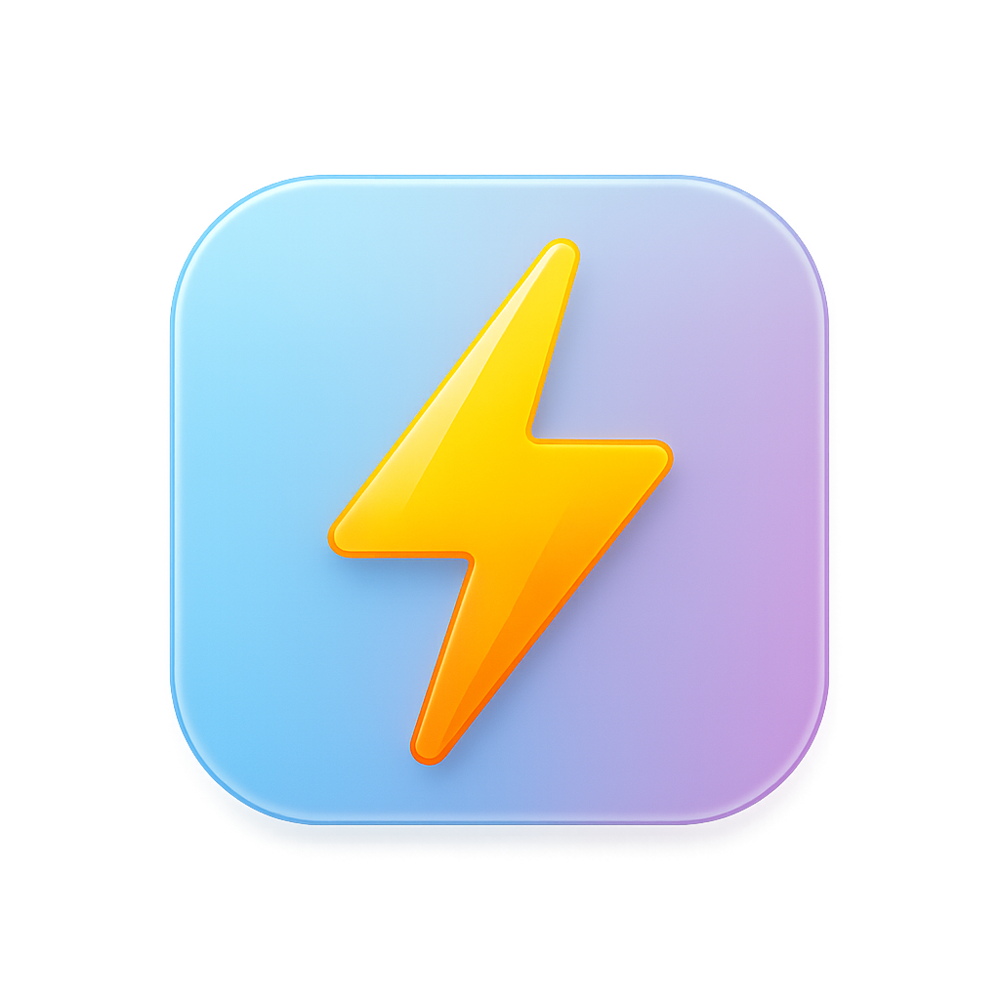

<span style="font-size:2em; vertical-align: middle;"><b>EnergyExchange: Blockchain-Based Carbon Credit Trading Platform</b></span>


## 🌍 Overview

**EnergyExchange** is a decentralized platform for transparent, privacy-preserving, and efficient carbon credit trading. Leveraging Ethereum smart contracts, ZK-SNARKs, and a modern MERN stack, the platform enables users to earn, buy, and sell tokenized carbon credits, with full on-chain verification and analytics.

- **Live Demo (Frontend):** [https://energyexchange.vercel.app](https://energyexchange.vercel.app)
- **Backend API:** [https://energyexchange.onrender.com](https://energyexchange.onrender.com)
- **Smart Contracts:** Deployed and verifiable on the Sepolia Ethereum Testnet


## 🚀 Table of Contents

- [🌍 Overview](#-overview)
- [🚀 Table of Contents](#-table-of-contents)
- [✨ Features](#-features)
- [🛠️ Tech Stack](#️-tech-stack)
- [⛓️ Smart Contracts \& Blockchain](#️-smart-contracts--blockchain)
- [🏗️ Architecture](#️-architecture)
- [🧑‍💻 Setup \& Installation](#-setup--installation)
  - [**Prerequisites**](#prerequisites)
  - [**Clone the Repository**](#clone-the-repository)
  - [**Backend Setup**](#backend-setup)
  - [**Frontend Setup**](#frontend-setup)
- [⚙️ Environment Variables](#️-environment-variables)
  - [**backend/.env**](#backendenv)
  - [**frontend/.env**](#frontendenv)
- [🧪 Testing \& Deployment](#-testing--deployment)
- [📊 Data Visualization](#-data-visualization)
- [🔒 Authentication \& Security](#-authentication--security)
- [📄 License](#-license)
- [📝 Notes](#-notes)
- [👥 Contributors](#-contributors)
- [🌐 Demo Links](#-demo-links)


## ✨ Features

- **User Authentication:** JWT-based, Google OAuth 2.0, and secure password hashing (bcryptjs)
- **Wallet Integration:** MetaMask, Ethers.js, Web3.js for seamless blockchain interaction
- **Carbon Credit Tokenization:** ERC-20 tokens for carbon credits, marketplace for trading
- **Zero-Knowledge Proofs:** ZK-SNARKs (Groth16/PLONK) for privacy-preserving balance verification
- **Device \& Data Logging:** On-chain energy data via registered IoT devices
- **Interactive Analytics:** Real-time charts (Chart.js, Recharts, Canvas API)
- **Email Verification \& OTP:** Secure onboarding with Nodemailer and Gmail SMTP
- **Admin Tools:** Device registration, order management, and user controls
- **Robust Security:** Rate limiting, CORS, bcrypt password hashing
- **Modern Dev Experience:** ESLint, Prettier, Nodemon, Git


## 🛠️ Tech Stack

| Layer | Technologies |
| :-- | :-- |
| Frontend | React, Redux, CSS, Chart.js, Recharts, Canvas API, Ethers.js, Web3.js, MetaMask SDK, Vercel |
| Backend | Node.js, Express.js, JWT, bcryptjs, Google OAuth 2.0, Nodemailer, CORS, Render |
| Blockchain | Solidity, Hardhat, Sepolia Testnet, Circom, Circomlib, SnarkJS, Groth16/PLONK, Infura |
| Database | MongoDB Atlas |
| Dev Tools | Nodemon, ESLint, Prettier, Git |

## ⛓️ Smart Contracts \& Blockchain

- **Token Contracts:**
    - Carbon Credit Token: `0xCa33F82670f4fB196CEDe4741F6045983893f0df`
    - Marketplace: `0x533FCA53FB28A56695Ae12D0524bE25dC08C3D9E`
    - Verifier (Carbon): `0xC82DE1f1336810c00e43e22150493946272d7D13`
    - Verifier (Transfer): `0xf44B74671E536265D69372a80f9ffC1F060bE2F3`
- **Contracts Verified On:**
[Sepolia Etherscan](https://sepolia.etherscan.io)
- **Node Hosting:**
[Infura Ethereum API](https://infura.io/) for reliable Ethereum node access
- **ZK-SNARKs:**
    - Circuit design: Circom + Circomlib
    - Trusted Setup: Powers of Tau
    - Proof Generation: SnarkJS
    - Protocols: Groth16 \& PLONK


## 🏗️ Architecture

- **Frontend:** React with Redux, data visualization (Chart.js, Recharts, Canvas API)
- **Backend:** Node.js/Express REST API, JWT authentication, Google OAuth, email/OTP verification
- **Blockchain:** Solidity smart contracts, ZK-SNARK verification, Infura node provider
- **Database:** MongoDB Atlas for user, device, and transaction data


## 🧑‍💻 Setup \& Installation

### **Prerequisites**

- Node.js \& npm
- Metamask wallet
- Access to Sepolia Ethereum testnet


### **Clone the Repository**

```bash
git clone https://github.com/yourusername/energyexchange.git
cd energyexchange
```


### **Backend Setup**

```bash
cd backend
npm install
# Create backend/.env (see below)
npm start
```


### **Frontend Setup**

```bash
cd frontend
npm install
# Create frontend/.env (see below)
npm start
```


## ⚙️ Environment Variables

### **backend/.env**

```env
# Server Configuration
PORT=3001
NODE_ENV=production
FRONTEND_URL=http://localhost:3000

# Database MongoDB
MONGODB_URI=your-mongodb-uri

# JWT
JWT_SECRET=your-jwt-secret
JWT_EXPIRE=2d

# Blockchain Configuration
INFURA_PROJECT_ID=your-infura-project-id
PRIVATE_KEY=your-ethereum-private-key
CONTRACT_ADDRESS=your-carbon-credit-contract-address
VERIFIER_CONTRACT_ADDRESS=your-verifier-contract-address
OWNER_PVT_KEY=your-owner-private-key
DEVICE_PVT_KEY=your-device-private-key
GENERAL_ACCOUNT_PVT_KEY=your-general-account-private-key

# ZK Proof
ZK_PROOF_KEY=./circuit_final.zkey

# Google OAuth
GOOGLE_CLIENT_ID=your-google-client-id
GOOGLE_CLIENT_SECRET=your-google-client-secret

# Email Configuration
MAILERSEND_API_KEY=your-mailersend-api-key
MAILERSEND_FROM_EMAIL=your-mailer-from-email

# Security
BCRYPT_ROUNDS=12
RATE_LIMIT_WINDOW=15
RATE_LIMIT_MAX=100

# Development Settings
DISABLE_EMAILS=false
```


### **frontend/.env**

```env
REACT_APP_API_URL=http://localhost:3001/api
REACT_APP_APP_NAME=Energy Trading Platform
REACT_APP_GOOGLE_CLIENT_ID=your-google-client-id
REACT_APP_CARBON_CREDIT_TOKEN=0xCa33F82670f4fB196CEDe4741F6045983893f0df
REACT_APP_MARKETPLACE=0x533FCA53FB28A56695Ae12D0524bE25dC08C3D9E
REACT_APP_VERIFIER_CARBON=0xC82DE1f1336810c00e43e22150493946272d7D13
REACT_APP_VERIFIER_TRANSFER=0xf44B74671E536265D69372a80f9ffC1F060bE2F3
REACT_APP_RPC_URL=https://sepolia.infura.io/v3/your-infura-project-id
REACT_APP_BLOCK_EXPLORER=https://sepolia.etherscan.io
```


## 🧪 Testing \& Deployment

- **Testing:**
    - Hardhat for smart contract/unit testing
    - Frontend: React Testing Library/Jest
    - Backend: Supertest/Jest
- **Deployment:**
    - **Frontend:** [Vercel](https://energyexchange.vercel.app)
    - **Backend:** [Render](https://energyexchange.onrender.com)


## 📊 Data Visualization

- **Chart.js:** Interactive energy analytics
- **Recharts:** React-based charting
- **Canvas API:** Custom visualizations


## 🔒 Authentication \& Security

- **JWT:** Stateless authentication
- **bcryptjs:** Password hashing
- **Google OAuth 2.0:** Social login
- **CORS:** Cross-origin resource sharing
- **Nodemailer:** Email verification \& OTP


## 📄 License

This project is open source under the [MIT License](LICENSE).

## 📝 Notes

- **Contracts are deployed and verifiable on the Sepolia Ethereum Testnet.**
- **All sensitive keys in `.env` files must be set before running locally or deploying.**
- **For production, use secure secrets and never commit `.env` files to version control.**


## 👥 Contributors

- [Your Name](mailto:your.email@example.com)
- [Other Contributors]


## 🌐 Demo Links

- **Frontend:** [https://energyexchange.vercel.app](https://energyexchange.vercel.app)
- **Backend:** [https://energyexchange.onrender.com](https://energyexchange.onrender.com)
- **Sepolia Etherscan:** [https://sepolia.etherscan.io](https://sepolia.etherscan.io)

> For questions, issues, or contributions, please open an issue or contact the maintainer.

**Enjoy using EnergyExchange!**
Empowering a greener future through transparent, blockchain-based carbon markets.
